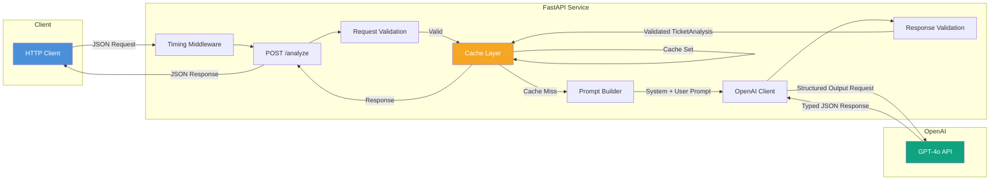
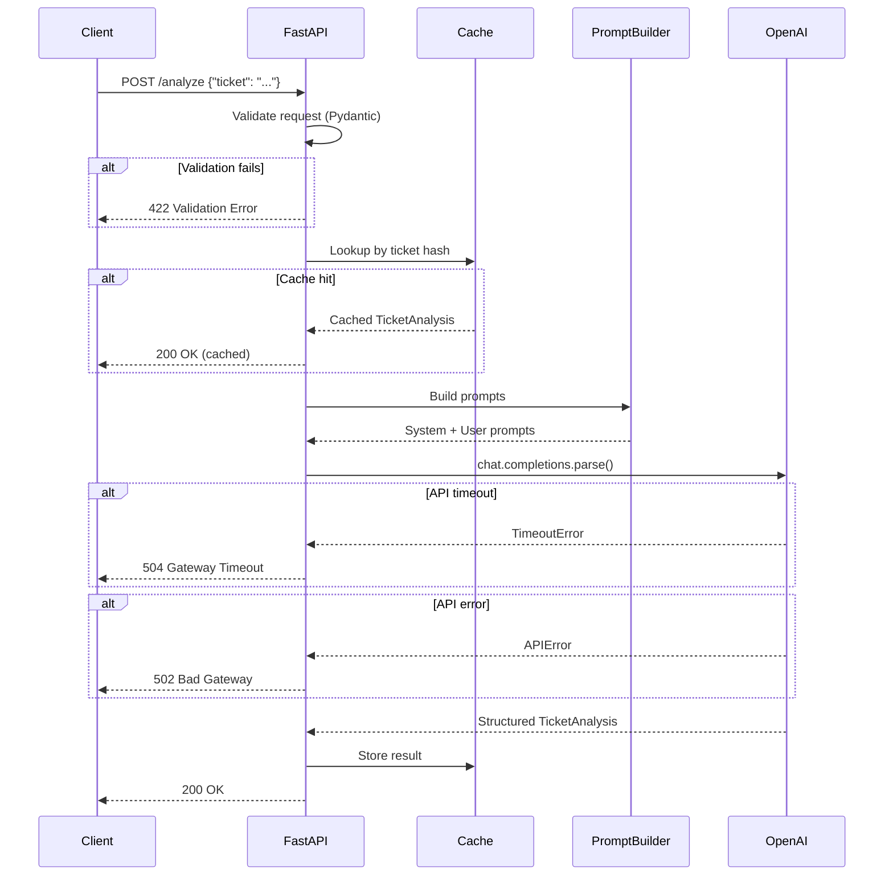

# Architecture

## Architecture Diagram

## Component Explanation

### FastAPI Application (`app/main.py`)
The entry point of the service. Defines the HTTP endpoints, wires up middleware (CORS, request timing, request-id, security headers), and orchestrates the analysis flow. Maps **provider-agnostic** errors (`Provider*` exceptions) to HTTP status codes, so it has no dependency on any specific AI SDK.

### Models (`app/models.py`)
Strongly-typed Pydantic models that serve triple duty:
1. **Request validation** — `TicketRequest` ensures non-empty ticket text with length constraints
2. **OpenAI schema** — `TicketAnalysis` is passed as `response_format` to enforce structured output
3. **API response** — The same `TicketAnalysis` model is the endpoint's return type

### AI Provider Abstraction (`app/ai/`)
The application is **provider-agnostic** — OpenAI is just one supported backend. Ticket analysis goes through a provider interface that decouples business logic from any specific AI SDK:
- **`base.py`** — `AnalysisProvider`, an abstract base class exposing `name`, `model`, `async analyze(ticket_text) -> TicketAnalysis`, and `aclose()`, plus a **provider-agnostic exception hierarchy** (`ProviderError` and `ProviderTimeoutError` / `ProviderRateLimitError` / `ProviderConnectionError` / `ProviderResponseError`). Implementations MUST translate backend-specific failures into these, which is what keeps the API layer provider-independent.
- **`config.py`** — `ProviderConfig`, a neutral value object (provider, model, api_key, base_url, timeout, max_retries, temperature). Providers depend on this, never on the app's global `Settings`.
- **`openai_provider.py`** — `OpenAIProvider`, built on the OpenAI SDK. Because it accepts a `base_url`, it serves **OpenAI and every OpenAI-compatible endpoint** (Groq, Together, OpenRouter, Ollama, custom). Uses `beta.chat.completions.parse()` for structured outputs, manages client lifecycle, handles refusals, retries via Tenacity, and translates SDK exceptions into the `Provider*` errors.
- **`factory.py`** — A registry mapping `AI_PROVIDER` names to a `ProviderSpec` (factory + per-provider default base URL/model + key/base-url requirements). `build_provider_config` resolves a `ProviderConfig` from settings and validates per-provider requirements (e.g. OpenAI needs a key; Ollama does not). Adding a backend with a *different* API (e.g. Anthropic, Gemini) means implementing `AnalysisProvider`, translating its errors, and adding one registry entry — **no business-logic, route, service, or persistence changes**.

Configuration is generic (`AI_PROVIDER`, `LLM_*`), with `OPENAI_*` accepted as backward-compatible environment aliases. The API key is optional so keyless providers (e.g. Ollama) run with no credentials.

`app/openai_client.py` is retained as a thin, provider-agnostic facade (`analyze_ticket`) so existing imports keep working.

### Application Factory & Dependency Injection (`app/main.py`, `app/dependencies.py`)
The app is built by `create_app(settings)`, which constructs shared resources (cache, AI provider, and — when configured — the DB engine/sessionmaker) once and stores them on `app.state`. Endpoints receive them via FastAPI `Depends` (`app/dependencies.py`), so resource lifecycle is explicit and dependencies are overridable in tests via `app.dependency_overrides`. The `lifespan` handler performs **graceful shutdown** — closing the provider client, the cache client, and disposing the DB engine. A module-level `app = create_app()` is exposed for `uvicorn app.main:app`.

### Authentication (`app/auth/`)
Authentication is **provider-agnostic**, mirroring the AI provider design:
- **`base.py`** — `AuthProvider` ABC (`authenticate(credentials) -> AuthenticatedIdentity`), the `AuthenticatedIdentity` value object, an `AuthError` hierarchy, and a `UserStore` port (decouples auth from the ORM). A provider's only job is to verify an external credential and return a normalized identity — it never issues sessions or resolves users.
- **`tokens.py` / `password.py`** — provider-agnostic shared layer: signed JWT access/refresh tokens and Argon2 password hashing, reused by every provider.
- **`local_provider.py`** — the M2.2 email/password provider, registered as `"local"` in **`factory.py`**.
- **`service.py`** — `AuthService` orchestrates signup/login/refresh/current-user: it resolves a provider from the registry, turns the identity into an application `User` (find-or-create; federated providers auto-provision), and issues tokens. Routes (`routes.py`, `/v1/auth/*`) and the `get_current_user` dependency depend only on this abstraction.

Adding a federated provider (Google, GitHub, Microsoft Entra, Auth0, any OIDC/OAuth2) means implementing `AuthProvider` + one registry entry (+ its own callback route); the token service, user store, `AuthService`, and authorization are reused unchanged. Auth requires both `JWT_SECRET` and `DATABASE_URL`; otherwise the endpoints return `503`.

### Multi-tenancy & API keys (`app/tenancy/`)
Every authenticated request resolves to a `TenantContext` (the active organization + principal), so business logic can scope to a tenant without knowing how the caller authenticated:
- **`base.py`** — `TenantContext`, the `OrgStore`/`ApiKeyStore` persistence ports, and a tenancy error hierarchy.
- **`api_key.py`** — key generation + SHA-256 hashing (API keys are high-entropy, so a fast hash is appropriate). Only the hash and a non-secret prefix are stored; the plaintext is returned once.
- **`service.py`** — `OrganizationService` (create/list orgs, membership checks) and `ApiKeyService` (create/list/revoke/authenticate).
- **`get_tenant_context`** dependency resolves the org from an `X-API-Key` header (→ the key's org) or a user JWT (their single membership, or an `X-Organization-Id` selection). API-key resolution does **not** require `JWT_SECRET`.

Org-scoped management routes (`/v1/orgs/{org_id}/…`) enforce membership via `require_org_membership` (403 otherwise), giving tenant isolation. **RBAC** is layered on top: `require_role(*roles)` (using the `Role` enum + `Membership.role`) gates privileged actions — e.g. API-key create/revoke require `owner`/`admin` — and `require_scope(*scopes)` gates API-key principals.

`POST /v1/analyze` is the authenticated, tenant-scoped analyze endpoint: it depends on `require_scope("analyze")`, resolves the org via `TenantContext`, and persists the analysis under that `organization_id`. It shares a single `run_analysis` orchestration (cache → provider → metrics → best-effort persist) with the legacy unauthenticated `/analyze` (which passes `organization_id=None`, unchanged). `Provider*` errors from either route are mapped centrally by a `ProviderError` exception handler, so both endpoints have identical error behavior. The cache key is namespaced by org so tenants never share cached analyses; the content hash still keys DB dedupe (scoped per-org).

### Health vs Readiness (`/health`, `/ready`, `app/readiness.py`)
`/health` is a pure **liveness** probe (process up; no dependency checks). `/ready` is a **readiness** probe that verifies the service's own infrastructure — a `SELECT 1` against the database (when configured) and a cache ping — returning `503` if any is unavailable. It deliberately does **not** call the AI provider: a paid/rate-limited third-party outage must not flap the pod out of rotation, so the provider is reported as configured-only.

### Response Cache (`app/cache/`)
An async `Cache` protocol (`get` / `set` / `aclose`) with two backends, selected by `build_cache` from settings:
- **`memory.py`** — `TTLCache`, a process-local LRU with per-entry TTL. The default, used when no `REDIS_URL` is set.
- **`redis.py`** — `RedisCache`, a shared, multi-instance cache with native TTL, used when `REDIS_URL` is set. **Best-effort**: any Redis error degrades to a cache miss (`get`) or a skipped write (`set`), so the API keeps working if Redis is down. Analyses are serialized as JSON under a namespaced key.

Business logic depends only on the protocol and `await`s `get`/`set`; the backend choice is invisible to callers. The cache client is closed in `lifespan`.

### Persistence (`app/db/`, `app/services/`)
Optional, enabled by `DATABASE_URL`. When configured, `create_app` builds an async engine + sessionmaker (stored on `app.state`, disposed in `lifespan`) and exposes the session factory via `get_db_sessionmaker`. After a successful analysis, the endpoint calls `analysis_service.persist_analysis`, which uses `db/repositories.py` to deduplicate the ticket by content hash and append a **versioned** analysis row. Persistence is **best-effort**: with no database it is a no-op, and any write failure is logged and swallowed so the API response is never affected.

The ORM also defines the **multi-tenancy** schema — `organizations`, `users`, `memberships`, `api_keys` — and a **nullable** `organization_id` on `tickets`/`analyses`. These exist at the data layer only: nothing is enforced yet and existing flows persist with `organization_id = NULL` (tenant scoping, auth, and API keys are wired in later milestones).

### Logging (`app/core/logging.py`)
Structured (JSON) or human-readable logging, configured by the application factory. A `ContextVar` populated by `RequestContextMiddleware` and a logging filter stamp every log line with the request's correlation id (`request_id`). Format is selectable via `LOG_FORMAT` (`json` default, `text` for local dev).

### Observability (`app/observability/`, `/metrics`)
Prometheus metrics via `prometheus-client`: HTTP request counts/latency (labelled by route template to bound cardinality), analysis outcomes, cache hit/miss, and LLM token usage. Exposed at `GET /metrics`. Token usage (`prompt`/`completion`/`total`) is extracted best-effort from the provider response, exported as metrics, and persisted on the `analyses.token_usage` column when a database is configured. The provider returns an `AnalysisResult` (analysis + optional `TokenUsage`) so usage flows to metrics/persistence while the API response and cached value remain the plain `TicketAnalysis`.

### Prompts (`app/prompts.py`)
Encapsulates prompt engineering:
- **System prompt** — Defines the AI's role, classification rules, priority guidelines, and output expectations
- **User prompt builder** — Wraps ticket text with clear delimiters to prevent prompt injection

### Configuration (`app/config.py`)
Uses `pydantic-settings` to load configuration from environment variables and `.env` files. Cached via `@lru_cache` for singleton behavior. Provides sensible defaults for all optional settings.

### Caching Layer
In-memory `OrderedDict`-based LRU cache with configurable max size (128 entries) and per-entry TTL (`CACHE_TTL_SECONDS`, default 300s; `0` disables caching). Expired entries are evicted lazily on access. Cache keys are SHA-256 hashes of normalized ticket text. Avoids redundant OpenAI API calls for duplicate tickets.

### Request Timing Middleware
HTTP middleware that measures end-to-end processing time and:
- Adds `X-Process-Time-Ms` response header
- Logs method, path, status code, and duration for every request

### HTTP Layer (`app/core/`)
Cross-cutting HTTP concerns, kept separate from business logic:
- **Middleware (`middleware.py`)** — `RequestContextMiddleware` assigns/echoes an `X-Request-ID` correlation id; `SecurityHeadersMiddleware` attaches `X-Content-Type-Options`, `X-Frame-Options`, and `Referrer-Policy` to every response.
- **Error handling (`errors.py`)** — Exception handlers render a consistent error envelope `{"error": {"code", "message", "request_id"}}` while preserving HTTP status codes. `code` is a stable, version-independent slug; unexpected errors return a generic `500` without leaking internals.
- **CORS** — Allowed origins are configurable (`CORS_ALLOW_ORIGINS`); credentials are never combined with a wildcard origin.

## Data Flow

## Alternative Approaches Considered

| Option | Pros | Cons |
|--------|------|------|
| **Direct OpenAI API** ✅ | Minimal dependencies, full control over prompts and retries, easy to debug, fast startup, structured outputs built-in | Requires manual retry implementation, no built-in chain abstractions |
| **LangChain** | Rich ecosystem, built-in chains and memory, community templates | Heavy dependency tree (~50+ packages), unnecessary abstraction for single-step classification, frequent breaking changes, slower startup |
| **Queue-Based Architecture** | Async processing, better scalability under load, retry via dead-letter queues | Significant infrastructure complexity (Redis/RabbitMQ/SQS), overkill for synchronous request-response, harder to deploy and monitor |

### Why Direct OpenAI API Was Chosen

The AI Ticket Analyzer has a straightforward architecture: **one prompt in, one structured response out**. This pattern maps perfectly to a direct API call.

**LangChain** would add over 50 transitive dependencies for a single `ChatOpenAI → StructuredOutputParser` chain — functionality already built into the OpenAI SDK via `response_format`. The abstraction provides no value here and introduces:
- Version coupling and frequent breaking changes
- Debugging opacity (stack traces through multiple abstraction layers)
- Cold start penalty from importing the dependency tree

**Queue-based architecture** is appropriate for high-throughput, async workloads (e.g., batch processing thousands of tickets). For a synchronous API serving one ticket at a time, it adds infrastructure burden (message broker, workers, result backend) without proportional benefit. If scaling becomes necessary, this architecture can be evolved:
1. Add a queue in front of the FastAPI service
2. Move OpenAI calls to background workers
3. Return ticket IDs and provide a polling endpoint

The current simple architecture keeps the codebase maintainable, deployment trivial (single Docker container), and latency predictable.
